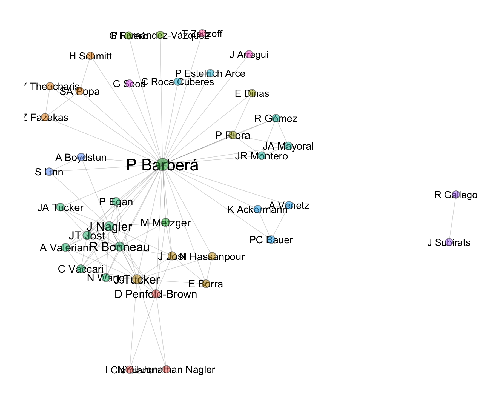
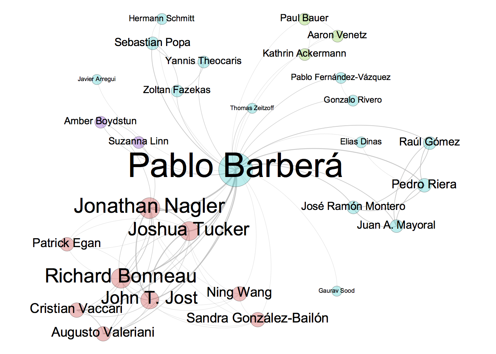

<script src="https://raw.githubusercontent.com/ramnathv/htmlwidgets/master/inst/www/htmlwidgets.js"></script>
<script src="https://raw.githubusercontent.com/mbostock/d3/master/d3.min.js" charset="utf-8"></script>
<script src="https://raw.githubusercontent.com/christophergandrud/networkD3/master/inst/htmlwidgets/forceNetwork.js"></script>


# Extract and Visualize Google Scholar Collaboration Networks

**scholarnetwork** is an R package that provides functions to extracts publication information from Google Scholar, create network of collaborators based on co-authored projects, and visualize these networks using a force-directed layout algorithm.

## Installation ##

An initial release of this package is available in this repository (eventually maybe also on CRAN), and can be installed directly using Hadley Wickham's [devtools](http://cran.r-project.org/web/packages/devtools/index.html) package:

```
if(!require("devtools")) install.packages("devtools")
library("devtools")
install_github("pablobarbera/scholarnetwork")
```

## Examples ##

For now, the package consists of two functions, `extractNetwork` and `plotNetwork`, which correspond to the data collection and data visualization steps.

`extractNetwork` wraps the `get_publications` function from the scholar package, which extracts the list of publications on a Google Scholar profile, cleans it, and then parses the results into a format that is more suitable for network analysis: 

- a data frame of __weighted edges__, where each edge is a collaboration in a publication, and the weight is one divided by number of co-authors; and 

- a data frame with __node-level information__, which includes the group resulting from running a walktrap community detection algorithm. 

```r
d <- extractNetwork(id="jGLKJUoAAAAJ", n=500)
str(d)
```
```
List of 2
 $ nodes:'data.frame':	40 obs. of  3 variables:
  ..$ label : chr [1:40] "A Boydstun" "A Valeriani" "A Venetz" "C Roca Cuberes" ...
  ..$ degree: num [1:40] 0.75 1.69 0.75 0.667 1.69 ...
  ..$ group : num [1:40] 11 7 10 8 7 1 3 4 5 13 ...
 $ edges:'data.frame':	106 obs. of  3 variables:
  ..$ node1 : chr [1:106] "P Barberá" "C Vaccari" "K Ackermann" "P Barberá" ...
  ..$ node2 : chr [1:106] "A Boydstun" "A Valeriani" "A Venetz" "A Venetz" ...
  ..$ weight: num [1:106] 0.25 0.31 0.25 0.25 0.25 ...
```

`plotNetwork` takes the lists of nodes and edges returned by `extractNetwork` and visualizes it using `networkD3`. The output of this function is an html file with the network visualization. Note that this function will also work with any other set of edge and node lists.

```r
plotNetwork(d$nodes, d$edges, file="network.html")
```
<div id="htmlwidget_container">
  <div id="htmlwidget-491" style="width:550px;height:400px;" class="forceNetwork"></div>
</div>
<script type="application/json" data-for="htmlwidget-491">{"x":{"links":{"source":[26,4,21,26,31,11,16,22,25,23,26,26,29,26,26,36,26,5,6,22,23,26,32,0,1,4,5,13,20,22,24,26,27,32,35,33,1,4,6,11,13,14,20,23,24,25,26,27,32,26,30,34,14,20,26,17,26,30,34,1,4,24,26,27,32,26,31,26,26,11,1,3,4,5,6,22,23,28,29,30,31,38,26,32,3,7,26,1,4,5,14,18,20,22,24,26,26,30,0,26,26,38,39,26,26,38],"target":[0,1,2,2,2,5,5,5,5,6,7,8,8,9,10,10,12,13,13,13,13,13,13,14,14,14,14,14,14,14,14,14,14,14,14,15,16,16,16,16,16,16,16,16,16,16,16,16,16,17,17,17,18,18,18,19,19,19,19,20,20,20,20,20,20,21,21,22,24,25,26,26,26,26,26,26,26,26,26,26,26,26,27,27,28,30,30,32,32,32,32,32,32,32,32,32,34,34,35,35,36,36,36,37,39,39]},"nodes":{"name":["A Boydstun","A Valeriani","A Venetz","C Roca Cuberes","C Vaccari","D Penfold-Brown","E Borra","E Dinas","G Rivero","G Sood","H Schmitt","I Cioroianu","J Arregui","J Jost","J Nagler","J Subirats","J Tucker","JA Mayoral","JA Tucker","JR Montero","JT Jost","K Ackermann","M Metzger","N Hassanpour","N Wang","NYU Jonathan Nagler","P Barberá","P Egan","P Estelrich Arce","P Fernández-Vázquez","P Riera","PC Bauer","R Bonneau","R Gallego","R Gómez","S Linn","SA Popa","T Zeitzoff","Y Theocharis","Z Fazekas"],"group":[11,7,10,8,7,1,3,4,5,13,2,1,14,3,7,12,3,9,7,9,7,10,6,3,7,1,6,7,8,5,4,10,7,12,9,11,2,15,2,2],"nodesize":[0.75,1.69047619047619,0.75,0.666666666666667,1.69047619047619,1.58333333333333,0.8,0.666666666666667,1.66666666666667,0.5,0.666666666666667,0.75,0.5,1.63333333333333,5.74047619047619,0.5,4.07380952380952,0.8,0.8,0.8,4.15714285714286,0.75,2.33333333333333,0.8,0.833333333333333,0.75,15.5071428571429,0.833333333333333,0.666666666666667,0.666666666666667,1.46666666666667,0.75,4.99047619047619,0.5,0.8,0.75,1.41666666666667,0.5,0.75,0.75]},"options":{"NodeID":"label","Group":"group","colourScale":"d3.scale.category20()","fontSize":10,"fontFamily":"serif","clickTextSize":25,"linkDistance":50,"linkWidth":"1","charge":-500,"linkColour":"#666","opacity":0.75,"zoom":false,"legend":false,"nodesize":true,"radiusCalculation":" Math.sqrt(d.nodesize)+6","bounded":false,"opacityNoHover":0,"clickAction":null}},"evals":[]}</script>
<script type="application/htmlwidget-sizing" data-for="htmlwidget-491">{"viewer":{"width":550,"height":400,"padding":10,"fill":false},"browser":{"width":550,"height":400,"padding":10,"fill":false}}</script>


The output of the `extractNetwork` function can also be used to generate a static version of this visualization with e.g. `ggplot2`:

```r
library(ggplot2)
library(igraph)
# cleaning network data
network <- graph_from_data_frame(d$edges, directed=FALSE)
set.seed(123)
l <- layout.fruchterman.reingold(network, niter=1500) # layout
fc <- walktrap.community(network) # community detection

# node locations
nodes <- data.frame(l); names(nodes) <- c("x", "y")
nodes$cluster <- factor(fc$membership)
nodes$label <- fc$names
nodes$degree <- degree(network)

# edge locations
edgelist <- get.edgelist(network, names=FALSE)
edges <- data.frame(nodes[edgelist[,1],c("x", "y")], nodes[edgelist[,2],c("x", "y")])
names(edges) <- c("x1", "y1", "x2", "y2")

# and now visualizing it...
p <- ggplot(nodes, aes(x=x, y=y, color=cluster, label=label, size=degree))
pq <- p + geom_text(color="black", aes(label=label, size=degree),
                    show_guide=FALSE) +
  # nodes
  geom_point(color="grey20", aes(fill=cluster),
             shape=21, show_guide=FALSE, alpha=1/2) +
  # edges
  geom_segment(
    aes(x=x1, y=y1, xend=x2, yend=y2, label=NA),
    data=edges, size=0.25, color="grey20", alpha=1/5) +
  ## note that here I add a border to the points
  scale_fill_discrete(labels=labels) +
  scale_size_continuous(range = c(5, 8)) +
  theme(
    panel.background = element_rect(fill = "white"),
    plot.background = element_rect(fill="white"),
    axis.line = element_blank(), axis.text = element_blank(),
    axis.ticks = element_blank(),
    axis.title = element_blank(), panel.border = element_blank(),
    panel.grid.major = element_blank(),
    panel.grid.minor = element_blank(),
    legend.background = element_rect(colour = F, fill = "black"),
    legend.key = element_rect(fill = "black", colour = F),
    legend.title = element_text(color="white"),
    legend.text = element_text(color="white")
  ) +
  ## changing size of points in legend
  guides(fill = guide_legend(override.aes = list(size=5)))

pq
```

<center></center>

However, it is difficult to make sure labels do not overlap. A probably better option is to export the network data to a format that Gephi can read, and then edit it manually in Gephi, as shown below.

```r
df <- data.frame(Source = d$edges$node1, Target = d$edges$node2)
write.csv(df, file="edgelist-gephi.csv", row.names=FALSE)
```

<center></center>
